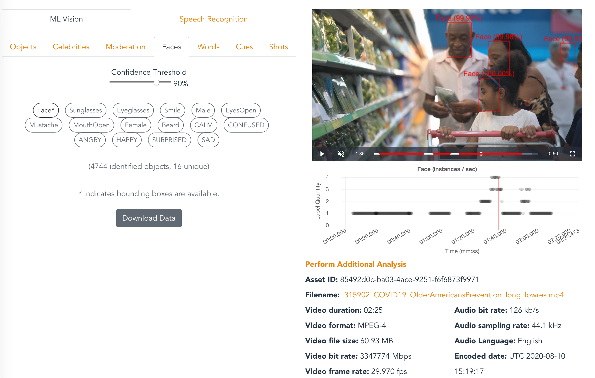
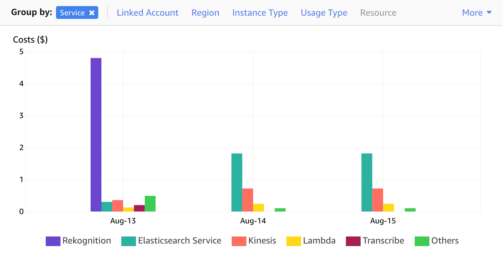
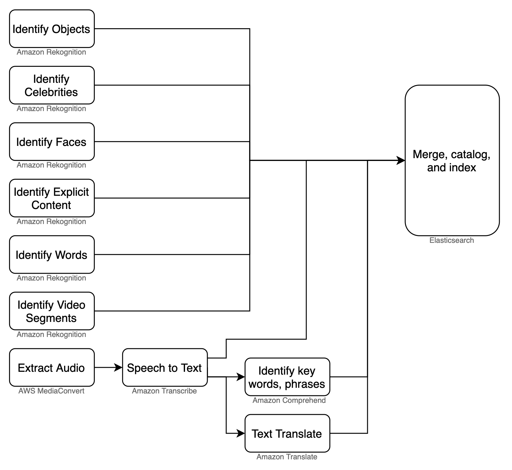
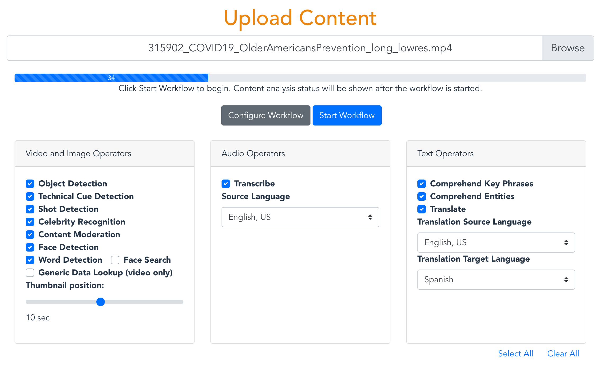
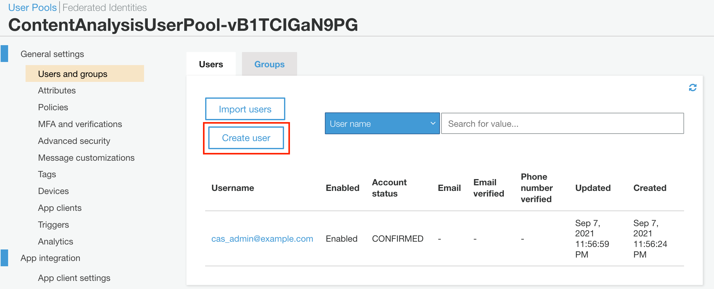
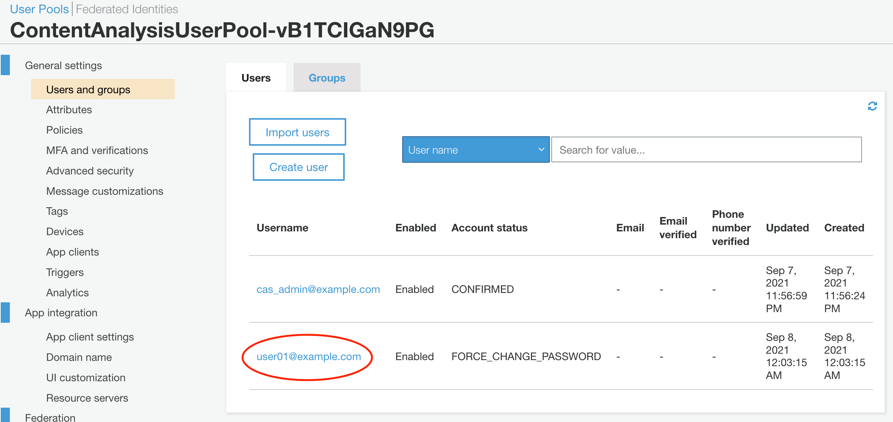
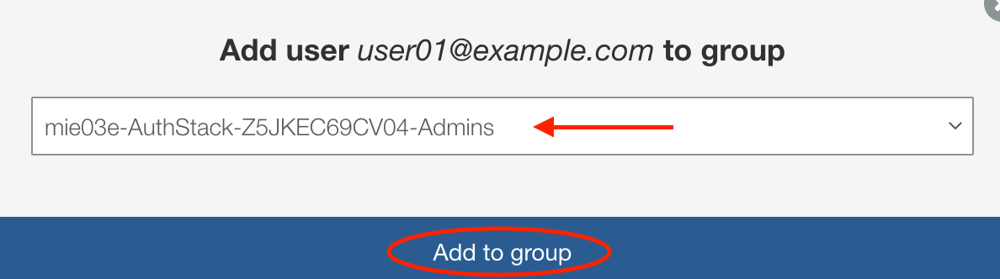

# AWS CONTENT ANALYSIS SOLUTION

This application is a demo reference application for the [Media Insights Engine](https://github.com/awslabs/aws-media-insights-engine) (MIE). It catalogs videos and images with data generated by AWS AI services for computer vision and speech detection. A graphical user interface (GUI) enables users to search through the catalog to find videos or images containing certain content and to analyze what the cataloged data looks like for selected files.



# INSTALLATION

The following Cloudformation templates will deploy the Content Analysis front-end application with a prebuilt Media Insights Engine back-end. **You must specify a Cloud Formation stack name that is 12 or fewer characters long**.

Region| Launch
------|-----
US East (N. Virginia) | [](https://console.aws.amazon.com/cloudformation/home?region=us-east-1#/stacks/new?stackName=mie&templateURL=https://rodeolabz-us-east-1.s3.us-east-1.amazonaws.com/content-analysis-solution/v2.0.5/cf/aws-content-analysis.template)
US West (Oregon) | [](https://console.aws.amazon.com/cloudformation/home?region=us-west-2#/stacks/new?stackName=mie&templateURL=https://rodeolabz-us-west-2.s3.us-west-2.amazonaws.com/content-analysis-solution/v2.0.5/cf/aws-content-analysis.template)

Once the Cloud Formation stack has been created, open the URL shown in the `ContentAnalyisSolution` output of the base stack. You can also get this URL with the following AWS CLI command:

```
aws cloudformation --region $REGION describe-stacks --stack-name $STACK_NAME --query "Stacks[0].Outputs[?OutputKey=='ContentAnalyisSolution'].OutputValue" --output text
```

For more installation options, see the [Advanced Installation](#advanced-installation-options) section.

# COST

You are responsible for the cost of the AWS services used while running this application. The primary cost factors are from using Amazon Rekognition and Amazon Elasticsearch Service (Amazon ES). Videos cost about $0.50 per minute to process, but can vary between $0.10 per minute and $0.60 per minute depending on the video content. If you disable Amazon Rekognition in your workflow configuration, then video costs can decrease to approximately $0.04 per minute. Data storage and Amazon ES will cost approximately ***$10.00 per day*** regardless of the quantity or type of video content.

After a video is uploaded into the solution, the costs for processing are a one-time expense. However, data storage costs occur daily, as shown in the following screenshot from AWS Cost Explorer.



For more information about cost, see the pricing webpage for each AWS service you will be using in this solution. If you need to process a large volume of videos, we recommend that you contact your AWS account representative for at-scale pricing. 

# Analysis Workflow

After uploading a video or image in the GUI, the application runs a workflow in MIE that extracts insights using a variety of media analysis services on AWS and stores them in a search engine for easy exploration. The following flow diagram illustrates this workflow:



This application includes the following features:

* Proxy encode of videos and separation of video and audio tracks using **AWS Elemental MediaConvert**. 
* Object and activity detection in images and video using **Amazon Rekognition**. 
* Celebrity detection in images and video using **Amazon Rekognition**
* Face search from a collection of known faces in images and video using **Amazon Rekognition**
* Facial analysis to detect facial features and faces in images and videos to determine things like happiness, age range, eyes open, glasses, facial hair, etc. In video, you can also measure how these things change over time, such as constructing a timeline of the emotions expressed by an actor.  From **Amazon Rekognition**.
* Unsafe content detection using **Amazon Rekognition**. Identify potentially unsafe or inappropriate content across both image and video assets.
* Detect text in videos and images using **Amazon Rekognition**.
* Video segment detection using **Amazon Rekognition**. Identify black frames, color bars, end credits, and scene changes.
* Identify start, end, and duration of each unique shot in your videos using **Amazon Rekognition.** 
* Convert speech to text from audio and video assets using **Amazon Transcribe**.
* Convert text from one language to another using **Amazon Translate**.
* Identify entities in text using **Amazon Comprehend**. 
* Identify key phrases in text using **Amazon Comprehend**

Users can enable or disable operators in the upload view shown below:



# Search Capabilities:

The search field in the Collection view searches the full media content database in Elasticsearch. Everything you see in the analysis page is searchable. Even data that is excluded by the threshold you set in the Confidence slider is searchable. Search queries must use valid Lucene syntax.

Here are some sample searches:

* Since Content Moderation returns a "Violence" label when it detects violence in a video, you can search for any video containing violence simply with: `Violence`
* Search for videos containing violence with a 80% confidence threshold: `Violence AND Confidence:>80` 
* The previous queries may match videos whose transcript contains the word "Violence". You can restrict your search to only Content Moderation results, like this: `Operator:content_moderation AND (Name:Violence AND Confidence:>80)`
* To search for Violence results in Content Moderation and guns or weapons identified by Label Detection, try this: `(Operator:content_moderation AND Name:Violence AND Confidence:>80) OR (Operator:label_detection AND (Name:Gun OR Name:Weapon))`  
* You can search for phrases in Comprehend results like this, `PhraseText:"some deep water" AND Confidence:>80`
* To see the full set of attributes that you can search for, click the Analytics menu item and search for "*" in the Discover tab of Kibana.

# Advanced Installation Options

## Building the solution from source code

The following commands will build the Content Analysis solution from source code. Be sure to define values for `EMAIL`, `WEBAPP_STACK_NAME`, and `REGION` first.

```
EMAIL=[specify your email]
WEBAPP_STACK_NAME=[specify a stack name]
REGION=[specify a region]
VERSION=1.0.0
git clone https://github.com/awslabs/aws-content-analysis
cd aws-content-analysis
cd deployment
DATETIME=$(date '+%s')
DIST_OUTPUT_BUCKET=aws-content-analysis-frontend-$DATETIME
aws s3 mb s3://$DIST_OUTPUT_BUCKET-$REGION --region $REGION
aws s3 mb s3://$TEMPLATE_OUTPUT_BUCKET --region $REGION
./build-s3-dist.sh --template-bucket ${TEMPLATE_OUTPUT_BUCKET} --code-bucket ${DIST_OUTPUT_BUCKET} --version ${VERSION} --region ${REGION}
```

Once you have built the demo app with the above commands, then it's time to deploy it. You have two options, depending on whether you want to deploy over an existing MIE stack or a new one:

#### *Option 1:* Install AWS Content Analysis over an existing MIE stack

Use these commands to deploy the demo app over an existing MIE stack:

```
MIE_STACK_NAME=[specify the name of your exising MIE stack]
TEMPLATE=[copy "With existing MIE deployment" link from output of build script]
aws cloudformation create-stack --stack-name $WEBAPP_STACK_NAME --template-url $TEMPLATE --region $REGION --parameters ParameterKey=MieStackName,ParameterValue=$MIE_STACK_NAME ParameterKey=AdminEmail,ParameterValue=$EMAIL --capabilities CAPABILITY_IAM CAPABILITY_NAMED_IAM CAPABILITY_AUTO_EXPAND --profile default --disable-rollback
```

#### *Option 2:* Install AWS Content Analysis with a new MIE stack

Use these commands to deploy the demo app over a new MIE stack:

```
TEMPLATE=[copy "Without existing MIE deployment" link from output of build script]
aws cloudformation create-stack --stack-name $WEBAPP_STACK_NAME --template-url $TEMPLATE --region $REGION --parameters ParameterKey=AdminEmail,ParameterValue=$EMAIL --capabilities CAPABILITY_IAM CAPABILITY_NAMED_IAM CAPABILITY_AUTO_EXPAND --profile default --disable-rollback
```

When finished your stack should look like this:


# Advanced Usage

## Starting workflows from the command line
***(Difficulty: 10 minutes)***

The video analysis workflow used by this application can be invoked from any HTTP client that supports AWS_IAM authorization, such as [awscurl](https://github.com/okigan/awscurl). The following commands show how to start the video analysis workflow using `awscurl`. Prior to running this command you must configure  `awscurl` to use your AWS access key and secret key for authorization, and define values for `SOURCE_BUCKET`, `SOURCE_KEY`, and `WORKFLOW_API_ENDPOINT`.

```
SOURCE_BUCKET=
SOURCE_KEY=
WORKFLOW_API_ENDPOINT=
# CasVideoWorkflow with default configuration:
awscurl -X POST --region us-west-2 --data '{"Name":"CasVideoWorkflow", "Input":{"Media":{"Video":{"S3Bucket": "'${SOURCE_BUCKET}'", "S3Key":"'${SOURCE_KEY}'"}}}}' ${WORKFLOW_API_ENDPOINT}workflow/execution | cut -f 2 -d "'" | perl -pe 's/"Definition.+?}]}}}",//g' | jq
# CasVideoWorkflow with custom configuration:
awscurl -X POST --region us-west-2 --data '{"Name":"CasVideoWorkflow", "Configuration":{"defaultVideoStage":{"faceDetection":{"MediaType":"Video","Enabled":true},"textDetection":{"MediaType":"Video","Enabled":true},"celebrityRecognition":{"MediaType":"Video","Enabled":true},"GenericDataLookup":{"MediaType":"Video","Enabled":false},"labelDetection":{"MediaType":"Video","Enabled":true},"personTracking":{"MediaType":"Video","Enabled":true},"shotDetection":{"MediaType":"Video","Enabled":true},"technicalCueDetection":{"MediaType":"Video","Enabled":true},"contentModeration":{"MediaType":"Video","Enabled":true},"faceSearch":{"MediaType":"Video","Enabled":false,"CollectionId":""}}}, "Input":{"Media":{"Video":{"S3Bucket": "'${SOURCE_BUCKET}'", "S3Key":"'${SOURCE_KEY}'"}}}}' ${WORKFLOW_API_ENDPOINT}workflow/execution | cut -f 2 -d "'" | perl -pe 's/"Definition.+?}]}}}",//g' | jq
```

Similarly, here's how to run the image analysis workflow:

```
awscurl -X POST --region us-west-2 --data '{"Name":"CasImageWorkflow", "Input":{"Media":{"Video":{"S3Bucket": "'${SOURCE_BUCKET}'", "S3Key":"'${SOURCE_KEY}'"}}}}' ${WORKFLOW_API_ENDPOINT}workflow/execution | cut -f 2 -d "'" | perl -pe 's/"Definition.+?}]}}}",//g' | jq
```

## Starting workflows from a Python Lambda function
***(Difficulty: 10 minutes)***

The following Python code can be used in an AWS Lambda function to execute the image analysis workflow:

* [sigv4_post_sample.py](https://github.com/awslabs/aws-media-insights-engine/blob/development/docs/sigv4_post_sample.py)


## Starting workflows from an S3 trigger
***(Difficulty: 10 minutes)***

Workflows can be started automatically when files are copied to a designated S3 bucket by using the following procedure:

1. Open the nested MieStack and click Update. 
   
   1. Select Update nested stack then click "Update stack".
   2. Click "Use current template" then click Next
   3. Write the S3 ARN in the `ExternalBucketArn` parameter which encompasses the objects you intend to process from your designated S3 bucket. For example, to allow MIE to process all the objects in a bucket named "sample_bucket", you could use `arn:aws:s3:::sample_bucket/*`.  
   4. Click Next. 
   5. Click Next, again. 
   6. Acknowledge the two options under Capabilities, then click "Update stack".
   
2. Open the AWS Lambda console
   
   1. Click "Create function"
   2. Provide a function name and select the latest Python runtime version
   Copy and paste the code from [sigv4_post_sample.py](https://github.com/awslabs/aws-media-insights-engine/blob/development/docs/sigv4_post_sample.py) into a new Lambda function.
   3. Under "Layers", click Add a layer
   4. Select Custom layers, then select `media-insights-engine-python38` from the drop-down menu, and click Add.
   5. Make the following code changes to the copied code:
   
- Put `import json` at the top
- Replace `{restapi_id}` with the value of the `WorkflowApiRestID` key in the MieStack outputs
- Replace `{region}` with the value of the region your stack is running in.
- Replace `{api_name}` with `workflow`
- Replace `{method_name}` with `execution`
- Replace `{s3_bucket}` with the name of the S3 bucket you specified in `ExternalBucketArn`, above.
- Replace `{s3_key}` with `event["Records"][0]["s3"]["object"]["key"]`
- Replace `os.environ.get('AWS_ACCESS_KEY_ID')` with your AWS_ACCESS_KEY_ID
- Replace `os.environ.get('AWS_SECRET_ACCESS_KEY')` with your AWS_SECRET_ACCESS_KEY
   
3. Setup an S3 trigger for the Lambda function, using the name of the S3 bucket you specified in `ExternalBucketArn`, above.

## Adding new operators and extending data stream consumers:
***(Difficulty: 60 minutes)***

The GUI for this demo application loads media analysis data from Elasticsearch. If you create a new analysis operator (see the MIE [Implementation Guide](https://github.com/awslabs/aws-media-insights-engine/blob/master/IMPLEMENTATION_GUIDE.md#4-implementing-a-new-operator-in-mie)) and you want to surface data from that new operator in this demo application, then edit `source/consumers/elastic/lambda_handler.py` and add your operator name to the list of `supported_operators`. Define a processing method to create Elasticsearch records from metadata JSON objects. This method should concatenate pages, flatten JSON arrays, add the operator name, add the workflow name, and add any other fields that can be useful for analytics. Call this processing method alongside the other processing methods referenced in the `lambda_handler()` entrypoint.

Finally, you will need to write front-end code to retrieve your new operator's data from Elasticsearch and render it in the GUI.

When you trigger workflows with your new operator, you should be able to validate how that operator's data is being processed from the Elasticsearch consumer log. To find this log, search Lambda functions for "ElasticsearchConsumer".

### Validate metadata in Elasticsearch

Validating data in Elasticsearch is easiest via the Kibana GUI. However, access to Kibana is disabled by default. To enable it, open your Elasticsearch Service domain in the AWS Console and click the "Modify access policy" under the Actions menu and add a policy that allows connections from your local IP address, such as:

```
{
  "Effect": "Allow",
  "Principal": {
    "AWS": "*"
  },
  "Action": "es:*",
  "Resource": "arn:aws:es:us-west-2:123456789012:domain/mie-es/*",
  "Condition": {
    "IpAddress": {
      "aws:SourceIp": "52.108.112.178/32"
    }
  }
}
```

Click Submit to save the new policy. After your domain is finished updating, click on the link to open Kibana. Now click on the **Discover** link from the left-hand side menu. This should take you to a page for creating an index pattern if you haven't created one already. Create an `mie*` index pattern in the **Index pattern** textbox. This will include all the indices that were created in the MIE stack.


Now you can use Kibana to validate that your operator's data is present in Elasticsearch. You can validate this by running a workflow where your operator is the only enabled operator, then searching for the asset_id produced by that workflow in Kibana.


# User Authentication

This solution uses [Amazon Cognito](https://docs.aws.amazon.com/cognito/index.html) for user authentication. When a user logs into the web application, Cognito provides temporary tokens that front-end Javascript components use to authenticate to back-end APIs in API Gateway and Elasticsearch. To learn more about these tokens, see [Using Tokens with User Pools](https://docs.aws.amazon.com/cognito/latest/developerguide/amazon-cognito-user-pools-using-tokens-with-identity-providers.html) in the Amazon Cognito documentation.

The front-end Javascript components in this application use the [Amplify Framework](https://docs.amplify.aws/) to perform back-end requests. You won't actually see any explicit handling of Cognito tokens in the source code for this application because that's all handled internally by the Amplify Framework. 

## User account management

All the necessary Cognito resources for this solution are configured in the [deployment/aws-content-analysis-auth.yaml](deployment/aws-content-analysis-auth.yaml) CloudFormation template and it includes an initial administration account. A temporary password for this account will be sent to the email address specified during the CloudFormation deployment. This administration account can be used to create additional user accounts for the application. 

Follow this procedure to create new user accounts:

1.	Sign in to the [Amazon Cognito console](https://console.aws.amazon.com/cognito/home).
2.	Choose Manage User Pools.
3.	In the User Pools page, select the user pool for your stack.
4.	From the left navigation pane, choose Users and Groups.
5.	On the Users tab, choose Create user.



6.	In the Create user dialog box, enter a username and temporary password.
7.	Choose Create user.
8.	On the User Pool page, under the Username column, select the user you just created.



9.	On the Users page, choose Add to group.
10.	In the Add user dialog box, access the drop-down list and select the user group corresponding to your auth stack.



The new user will now be able to use the web application.

# Uninstall

To uninstall the AWS Content Analysis solution, delete the CloudFormation stack, as described below. This will delete all the resources created for the Content Analysis solution except the `Dataplane` and the `DataplaneLogs` S3 buckets. These two buckets are retained when the solution stack is deleted in order to help prevent accidental data loss. You can use either the AWS Management Console or the AWS Command Line Interface (AWS CLI) to empty, then delete those S3 buckets after deleting the CloudFormation stack.

### Option 1: Uninstall using the AWS Management Console
1. Sign in to the AWS CloudFormation console.
2. Select your AWS Content Analysis stack.
3. Choose Delete.

### Option 2: Uninstall using AWS Command Line Interface
```
aws cloudformation delete-stack --stack-name <installation-stack-name> --region <aws-region>
```

### Deleting Content Analysis S3 buckets
AWS Content Analysis creates two S3 buckets that are not automatically deleted. To delete these buckets, use the steps below.

1. Sign in to the Amazon S3 console.
2. Select the `Dataplane` bucket.
3. Choose Empty.
4. Choose Delete.
5. Select the `DataplaneLogsBucket` bucket.
6. Choose Empty.
7. Choose Delete.

To delete an S3 bucket using AWS CLI, run the following command:
```
aws s3 rb s3://<bucket-name> --force
```

## Collection of operational metrics

This solution includes an option to send anonymous operational metrics to AWS. Solution developers use this data to help improve the quality of the solution. When enabled, the following information is collected and sent to AWS:

* **Solution ID:** the AWS solution ID (`SO0042`)
* **Unique ID (UUID):** a randomly generated, unique identifier for each deployment
* **Timestamp:** data-collection timestamp
* **Version:** The version of the solution that was deployed
* **CFTemplate:** The CloudFormation action that activated the metric report.

Example data:

```
{
    "Solution": "SO0042",
    "UUID": "d84a0bd5-7483-494e-8ab1-fdfaa7e97687",
    "TimeStamp": "2021-03-01T20:03:05.798545",
    "Data": {
        "Version": "v2.0.0",
        "CFTemplate": "Created"
    }
}
```

To opt out of this reporting, edit [deployment/aws-content-analysis.yaml](deployment/aws-content-analysis.yaml) and change `AnonymousUsage` in the `Mappings` section from:

```
"Send" : {
"AnonymousUsage" : { "Data" : "Yes" }
},
```

to:

```
"Send" : {
"AnonymousUsage" : { "Data" : "No" }
},
```

# Known Issues

Visit the Issue page in this repository for known issues and feature requests.

# Contributing

See the [CONTRIBUTING](CONTRIBUTING.md) file for how to contribute.

# License

See the [LICENSE](LICENSE.txt) file for our project's licensing.

Copyright Amazon.com, Inc. or its affiliates. All Rights Reserved.

Unless required by applicable law or agreed to in writing, software distributed under the License is distributed on an "AS IS" BASIS, WITHOUT WARRANTIES OR CONDITIONS OF ANY KIND, either express or implied.

# Help

Join our Gitter chat at [https://gitter.im/awslabs/aws-media-insights-engine](https://gitter.im/awslabs/aws-media-insights-engine). This public chat forum was created to foster communication between MIE developers worldwide.

[](https://gitter.im/awslabs/aws-media-insights-engine)

